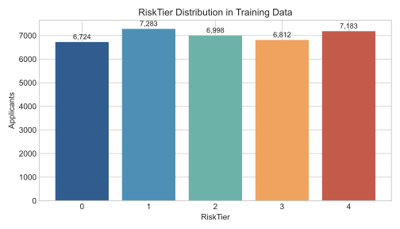
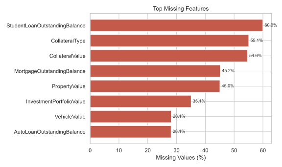
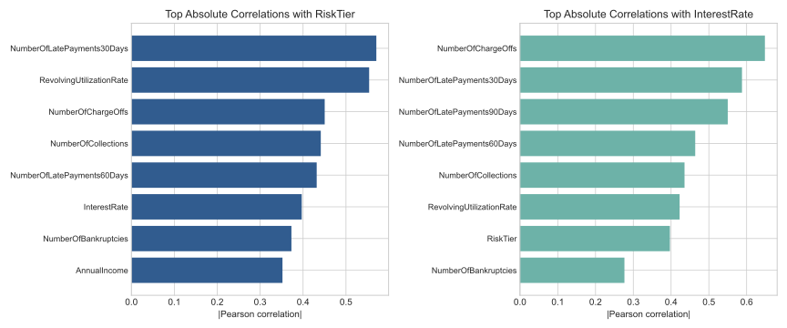
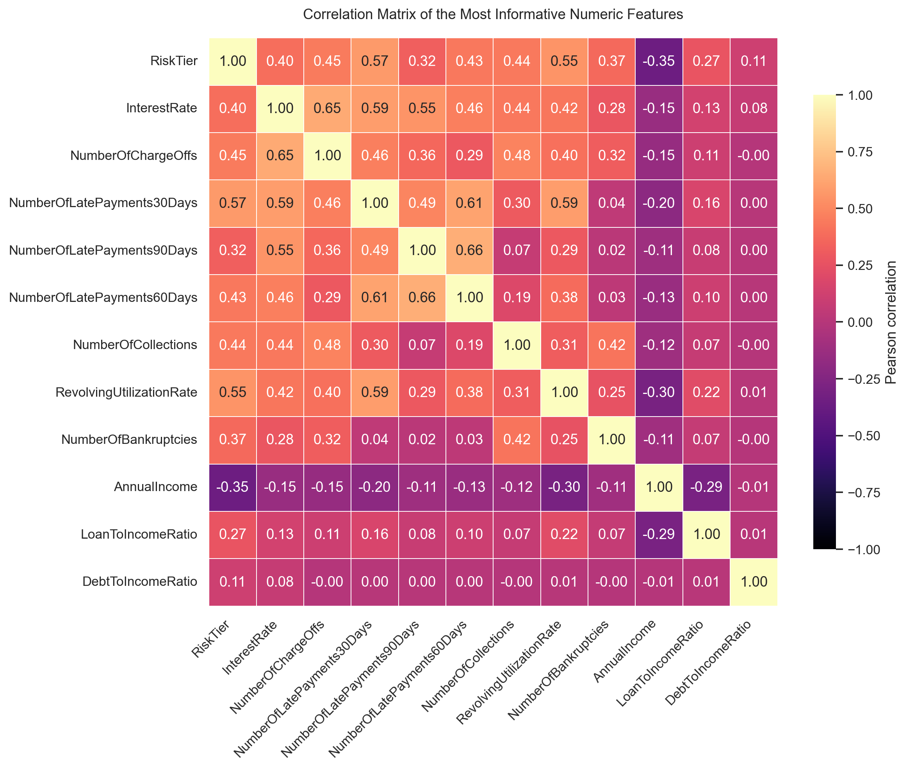
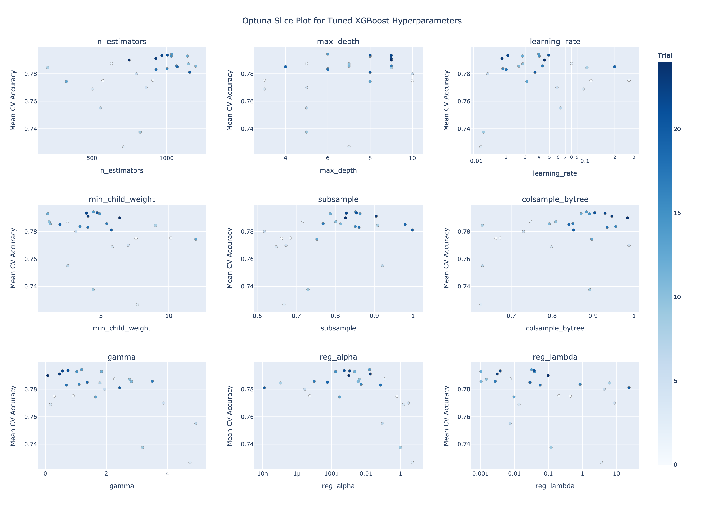
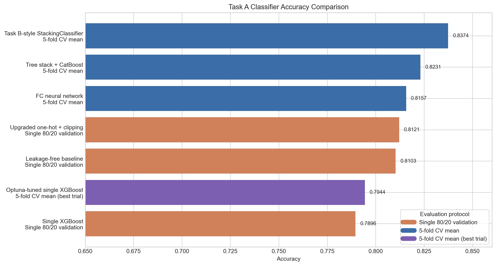
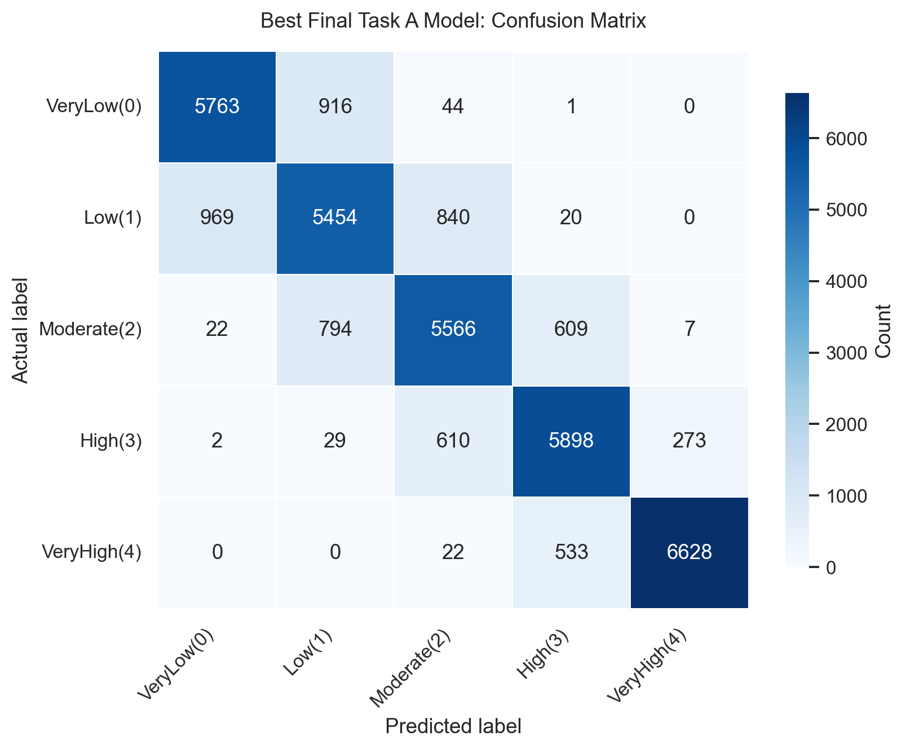

# CreditSense: Loan Risk Assessment Challenge

**Team name:** `[fill in before PDF export]`  
**Student names:** `[fill in before PDF export]`  
**Kaggle username(s):** `[fill in before PDF export]`

This report summarizes the current repository state for the AI1215 group project. Task A classification was primarily developed by **Dachi Tchotashvili**, while Task B regression was primarily developed by **Guram Matcharashvili**. The main sources used here are the assignment brief in [project_description.pdf](project_description.pdf), the experiment log in [TaskA.md](../TaskA.md), the Task A reports under [`task_a/reports/`](../task_a/reports), the XGBoost tuning notebook [taskA_xgboost_optuna.ipynb](../task_a/notebooks/taskA_xgboost_optuna.ipynb), and Guram's regression notebook [Task_B.ipynb](../task_b/notebooks/Task_B.ipynb).

## 1. Data Exploration & Preprocessing

The training set contains **35,000 applicants**, **55 input features**, and two targets: `RiskTier` for classification and `InterestRate` for regression. The class balance is close to uniform across the five risk tiers, so plain accuracy is a meaningful primary metric for Task A and is not dominated by one majority class.

*Figure 1. The Task A class distribution is close to uniform: tier 0 = 6,724, tier 1 = 7,283, tier 2 = 6,998, tier 3 = 6,812, tier 4 = 7,183.*

Missingness is highly structured rather than random. `StudentLoanOutstandingBalance` is missing for **59.98%** of rows, `CollateralType` for **55.06%**, `CollateralValue` for **54.64%**, and both `MortgageOutstandingBalance` and `PropertyValue` for roughly **45%** of the dataset. These are not ordinary nulls: in many cases they mean the applicant simply does not have the relevant liability, asset, or collateral.

*Figure 2. The largest missing blocks come from structurally absent collateral, asset, and loan-balance features.*

The strongest univariate relationships are concentrated in credit-history variables. For `RiskTier`, the largest absolute correlations are `NumberOfLatePayments30Days` (`0.5707`), `RevolvingUtilizationRate` (`0.5540`), `NumberOfChargeOffs` (`0.4504`), and `NumberOfCollections` (`0.4413`). For `InterestRate`, the most important variables are `NumberOfChargeOffs` (`0.6484`), `NumberOfLatePayments30Days` (`0.5877`), `NumberOfLatePayments90Days` (`0.5500`), and `NumberOfLatePayments60Days` (`0.4639`).

*Figure 3. Both tasks are dominated by credit-history severity, but pricing is even more sensitive to severe derogatory marks such as charge-offs and 90-day delinquencies.*

To make multivariate structure legible in the report, the correlation heatmap below focuses on the most informative numeric variables rather than the full 55-feature matrix. It uses a seaborn heatmap with the **magma** palette and annotated coefficients in every cell.

*Figure 4. Correlation matrix for the most informative numeric features and both targets. Late-payment counts, charge-offs, collections, utilization, and `RiskTier` form the dominant risk cluster, while `AnnualIncome` moves in the opposite direction.*

These observations directly shaped preprocessing:

- **Task A** used split-first preprocessing to avoid leakage, explicit `"Missing"` categories for absent labels, missing-value indicators for numeric features, structural zero-fill where absence meant “does not have this item”, median imputation for remaining numerics, 99th-percentile clipping for heavy-tailed money and ratio variables, `log1p` on money-like features, and strict schema alignment after one-hot encoding.
- **Task B** used Guram Matcharashvili's regression notebook pipeline: median imputation for numerics, most-frequent imputation plus one-hot encoding for categoricals, and additional `StandardScaler` normalization only for the neural-network branch.

## 2. Feature Engineering

Most gains in this repository came from better tabular representations rather than from large numbers of handcrafted business variables. The main additions were:

| Addition | Motivation | Where used |
| --- | --- | --- |
| Numeric `*_is_missing` indicators | Preserve signal from structured missingness instead of hiding it behind imputation | Task A |
| Structural zero-fill for balances / assets | Encode “not present” as zero when that is the correct financial meaning | Task A |
| 99th-percentile clipping | Reduce sensitivity to extreme outliers in skewed financial variables | Task A |
| `log1p` transforms on money-like features | Compress long right tails and make relative differences more learnable | Task A |
| Pairwise products among top 10 correlated numeric features | Let the FC neural network model interactions between delinquency, utilization, and affordability signals | Task A FC neural network |
| Task-specific scaling | Standardize continuous inputs for logistic / MLP branches without distorting tree-model inputs | Task A stack and Task B MLP |

For the FC neural-network experiment, the top 10 fold-stable features were `NumberOfLatePayments30Days`, `RevolvingUtilizationRate`, `NumberOfChargeOffs`, `NumberOfCollections`, `NumberOfLatePayments60Days`, `AnnualIncome`, `NumberOfBankruptcies`, `NumberOfLatePayments90Days`, `LoanToIncomeRatio`, and `NumberOfHardInquiries12Mo`. Dachi created all **45 pairwise interactions** among them, expanding the neural-network matrix from **115** processed base features to **160** final features.

The repository does not contain a one-by-one ablation for every preprocessing step, but it does contain a measured before/after comparison for the full upgraded Task A preprocessing bundle:

| Task A preprocessing setup | Evaluation protocol | Accuracy | Macro F1 | Change vs previous |
| --- | --- | ---: | ---: | --- |
| Leakage-free repaired baseline | Single 80/20 validation split | `0.8103` | `0.8120` | Baseline |
| One-hot + missing indicators + structural zero-fill + clipping + `log1p` | Single 80/20 validation split | `0.8121` | `0.8139` | `+0.0018` accuracy, `+0.0019` macro F1 |

The gain is modest but important because it came **after removing leakage**, so the improvement is more trustworthy than the earlier inflated baseline behavior.

## 3. Model Selection

### 3.1 Task A: Classification (`RiskTier`)

Task A is the richest experimental branch in the repository. The explored candidate families were:

- repaired baseline tree workflow after leakage removal;
- upgraded one-hot / zero-fill / clipping pipeline;
- a fully connected neural network with engineered interactions;
- a tree stack that adds a native-categorical `CatBoostClassifier`;
- a Task B-style `StackingClassifier` that mixes tree, linear, and neural branches;
- a standalone `XGBClassifier` branch with explicit Optuna tuning.

The strongest Task A candidates are summarized below.

| Model | Evaluation protocol | Accuracy | Macro F1 | Notes |
| --- | --- | ---: | ---: | --- |
| FC neural network | 5-fold CV mean | `0.8157` | `0.8166` | `MLPClassifier` with 45 engineered pairwise interactions |
| Tree stack + CatBoost | 5-fold CV mean | `0.8231` | `0.8247` | RF + XGB + LGBM + native-categorical CatBoost, linear meta-layer |
| Task B-style StackingClassifier | 5-fold CV mean | `0.8374` | `0.8380` | XGB + RF + HGB + logistic + MLP, multinomial logistic meta-learner |
| Optuna-tuned single XGBoost | 5-fold CV best trial | `0.7944` | `0.7950` | Strongest standalone XGB configuration found by TPE search |
| Standalone XGBoost validation run | Single 80/20 validation split | `0.7896` | `0.7903` | Rerun with Optuna-best parameters and Task A preprocessing |

The best final classifier is the **Task B-style StackingClassifier**. Its main advantage is model diversity: the tree models capture nonlinear tabular structure, while the logistic and MLP branches add smoother global boundaries and complementary probability estimates for the meta-learner.

### 3.2 Task B: Regression (`InterestRate`)

Guram Matcharashvili's Task B notebook used a five-model regression stack:

- `XGBRegressor`
- `RandomForestRegressor`
- `HistGradientBoostingRegressor`
- `LinearRegression`
- `MLPRegressor`
- `Ridge(alpha=1.0)` as the final estimator in `StackingRegressor`

The final recorded Task B result on an 80/20 split was:

| Final Task B model | RMSE | MAE | R² |
| --- | ---: | ---: | ---: |
| StackingRegressor (XGB + RF + HGB + LR + MLP -> Ridge) | `1.7052` | `1.3433` | `0.8248` |

Locally reproduced single-model baselines on the same split show that the full stack still performed best:

| Model | RMSE | MAE | R² |
| --- | ---: | ---: | ---: |
| HistGradientBoostingRegressor | `1.7196` | `1.3472` | `0.8219` |
| RandomForestRegressor | `1.7929` | `1.4025` | `0.8064` |
| MLPRegressor | `1.8584` | `1.4310` | `0.7919` |
| LinearRegression | `2.5464` | `1.7083` | `0.6094` |
| StackingRegressor (final notebook artifact) | `1.7052` | `1.3433` | `0.8248` |

## 4. Hyperparameter Tuning

### 4.1 Earlier Gradient-Style Search

The repository contains an earlier gradient-descent-style attempt in [optimize_taskA_hyperparams.py](../task_a/scripts/optimize_taskA_hyperparams.py). Because the Task A objective depends on tree ensembles, rounded integer hyperparameters, and validation metrics, ordinary gradient descent is not mathematically appropriate. The script therefore used **SPSA** (Simultaneous Perturbation Stochastic Approximation) as a gradient-like approximation. That experiment was useful as a baseline, but the script itself explicitly notes that **Optuna / Bayesian optimization is a better fit** for this mixed discrete + continuous search problem.

### 4.2 XGBoost + Optuna Pipeline

The full standalone XGBoost tuning workflow is documented in [taskA_xgboost_optuna.ipynb](../task_a/notebooks/taskA_xgboost_optuna.ipynb) and implemented in [taskA_xgb_optuna.py](../task_a/scripts/taskA_xgb_optuna.py). The core Optuna calls are:

- `optuna.create_study(...)`
- `optuna.samplers.TPESampler(seed=42)`
- `study.optimize(objective, n_trials=25, timeout=None, show_progress_bar=False)`
- `optuna.visualization.plot_slice(...)`

The sampler used was **TPE** (Tree-structured Parzen Estimator), which is a Bayesian optimization method. Briefly, it does not sweep the whole space like grid search. Instead, it fits probability models to the regions that have produced good trials and the regions that have produced poor trials, then proposes the next hyperparameter set in areas that look promising for improving the target score.

The study optimized **mean 5-fold cross-validation accuracy** with the following fixed study settings:

| Setting | Value |
| --- | --- |
| Study name | `taskA_xgb_optuna` |
| Sampler | `TPESampler(seed=42)` |
| Trials | `25` |
| Outer CV | `StratifiedKFold(n_splits=5, shuffle=True, random_state=42)` |
| Metric optimized | `accuracy` |
| Early stopping | `True` |
| Early stopping rounds | `40` |
| Internal early-stopping holdout | `0.1` of the fold-training partition |
| `scale_pos_weight` search | Disabled (`include_scale_pos_weight=False`) because Task A is multiclass |

The pipeline executed inside each Optuna trial was:

1. Sample one candidate hyperparameter set from the search space.
2. Split the full training data with 5-fold stratified CV.
3. For each outer fold, reserve the fold validation split strictly for scoring.
4. Inside the fold-training partition, create a smaller internal holdout for XGBoost early stopping.
5. Fit the Task A preprocessor only on the fold-training subset.
6. Train `XGBClassifier` with early stopping on the internal holdout.
7. Extract `best_iteration` / `best_n_estimators`.
8. Refit the fold model on the full outer training fold using the selected tree count.
9. Score the outer validation fold.
10. Return mean fold accuracy to Optuna as the objective value.

This keeps the outer validation folds clean and uses the inner holdout only for stopping the boosting process.

The exact Optuna search space was:

| Hyperparameter | Distribution | Search range | Best value found |
| --- | --- | --- | ---: |
| `n_estimators` | Integer | `200` to `1200` | `1035` |
| `max_depth` | Integer | `3` to `10` | `6` |
| `learning_rate` | Log-uniform float | `0.01` to `0.30` | `0.0399230666` |
| `min_child_weight` | Float | `1.0` to `12.0` | `4.4423116573` |
| `subsample` | Float | `0.6` to `1.0` | `0.8524337374` |
| `colsample_bytree` | Float | `0.6` to `1.0` | `0.8837262829` |
| `gamma` | Float | `0.0` to `5.0` | `1.1909377972` |
| `reg_alpha` | Log-uniform float | `1e-8` to `10.0` | `0.0159368471` |
| `reg_lambda` | Log-uniform float | `1e-3` to `25.0` | `0.0318485426` |

The best completed trial reached:

- **Mean 5-fold CV accuracy:** `0.7944`
- **Mean 5-fold CV macro F1:** `0.7950`
- **Best standalone rerun on a fresh 80/20 validation split:** `0.7896` accuracy, `0.7903` macro F1

The figure below was generated from the finished Optuna run stored in `task_a/artifacts/taskA_xgb_optuna_optuna_trials.csv`. It uses `optuna.visualization.plot_slice` to show how each searched hyperparameter varied against **mean cross-validation accuracy** across the completed trials.

*Figure 5. Slice plots reconstructed from the completed Optuna study. Each panel shows one searched hyperparameter against mean 5-fold CV accuracy.*

The main takeaway is that tuning substantially improved the standalone XGBoost branch, but the single-model ceiling remained below the best stacked ensembles. This is an important result in itself: in this repository, **representation quality plus ensemble diversity mattered more than tuning one tree model alone**.

## 5. Results & Summary

### 5.1 Task A Classifier Summary

The Task A experiments used mixed evaluation protocols, so the table below should be read with care. The point of the summary is not to claim perfect apples-to-apples comparability between every row, but to show the progression of the classification work in the repository.

| Model | Evaluation protocol | Accuracy | Macro F1 |
| --- | --- | ---: | ---: |
| Single XGBoost | Single 80/20 validation split | `0.7896` | `0.7903` |
| Optuna-tuned single XGBoost | 5-fold CV mean (best trial) | `0.7944` | `0.7950` |
| Leakage-free baseline | Single 80/20 validation split | `0.8103` | `0.8120` |
| Upgraded one-hot + clipping | Single 80/20 validation split | `0.8121` | `0.8139` |
| FC neural network | 5-fold CV mean | `0.8157` | `0.8166` |
| Tree stack + CatBoost | 5-fold CV mean | `0.8231` | `0.8247` |
| Task B-style StackingClassifier | 5-fold CV mean | `0.8374` | `0.8380` |

*Figure 6. Horizontal accuracy comparison of all recorded Task A classifiers. Colors indicate evaluation protocol, so the plot should be interpreted together with the table above.*

The best final model is the **Task B-style StackingClassifier**. It improved on the Tree stack + CatBoost baseline by **+0.0143** accuracy and **+0.0133** macro F1, and improved on the FC neural network by **+0.0217** accuracy and **+0.0214** macro F1.

Its confusion matrix is shown below.

*Figure 7. Confusion matrix of the best final Task A classifier (Task B-style StackingClassifier).*

This final model remained strongest on the extreme class `VeryHigh(4)` and still struggled most on the middle buckets, especially `Low(1)` and `Moderate(2)`. That pattern is expected in credit risk: the edge cases are easier to separate than the borderline applicants in the middle of the distribution.

### 5.2 Task B Regression Summary

Task B remained strong as well. The final regression stack achieved:

| Final Task B model | RMSE | MAE | R² |
| --- | ---: | ---: | ---: |
| StackingRegressor (XGB + RF + HGB + LR + MLP -> Ridge) | `1.7052` | `1.3433` | `0.8248` |

The best reproduced single-model baseline was `HistGradientBoostingRegressor` at `R² = 0.8219`, so the stack still delivered the best overall result, even if the margin was smaller than in Task A.

### 5.3 Summary Reflection & Learnings

- **Leakage removal and structured-missingness handling were foundational.** The biggest early step was making the Task A preprocessing honest before adding more complex models.
- **Feature engineering mattered, but ensemble diversity mattered more.** Missingness indicators, zero-fill, clipping, and `log1p` created a better input space; the best gains after that came from combining diverse model families.
- **A tuned single XGBoost was not enough to beat the best stacks.** Optuna improved the standalone XGBoost branch substantially, but it still stayed below the best heterogeneous ensembles.
- **The hardest region of the task is the middle of the label space.** `Low(1)` and `Moderate(2)` remain the most confusable classes, which is visible in every serious classifier report.
- **There is still room to improve the tuning stage.** The Optuna run used only 25 trials, tuned only the standalone XGBoost branch, and searched a moderate space. Future work should widen the search ranges, increase trial count, and tune the stronger stacked models as well.

Overall, the repository clearly exceeds the assignment baselines on both tasks. The strongest Task A result is the **Task B-style StackingClassifier** at **0.8374 accuracy / 0.8380 macro F1**, and the strongest Task B result is the regression stack at **`R² = 0.8248`**. The core lesson from the project is that in structured financial tabular data, **careful preprocessing and heterogeneous ensembles were more valuable than relying on one model family alone**.
