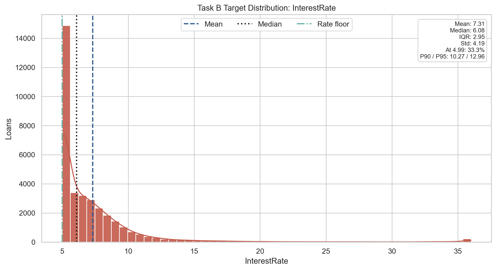
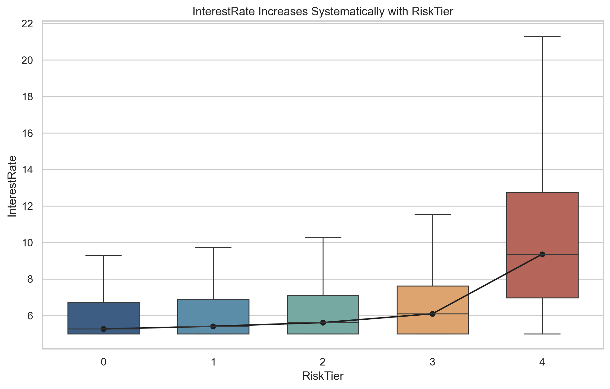
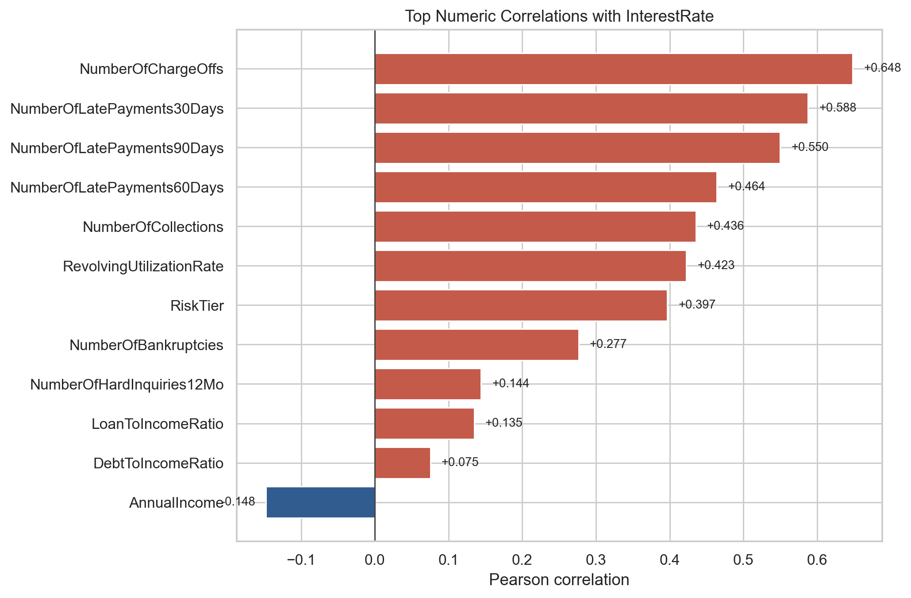
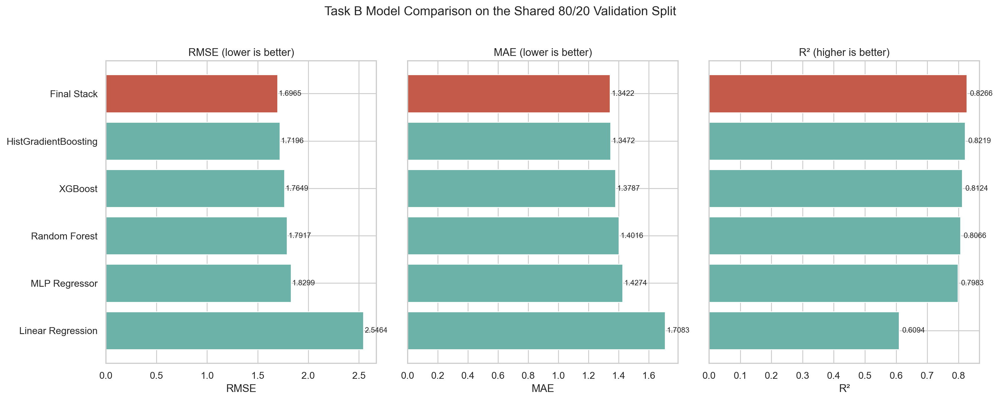
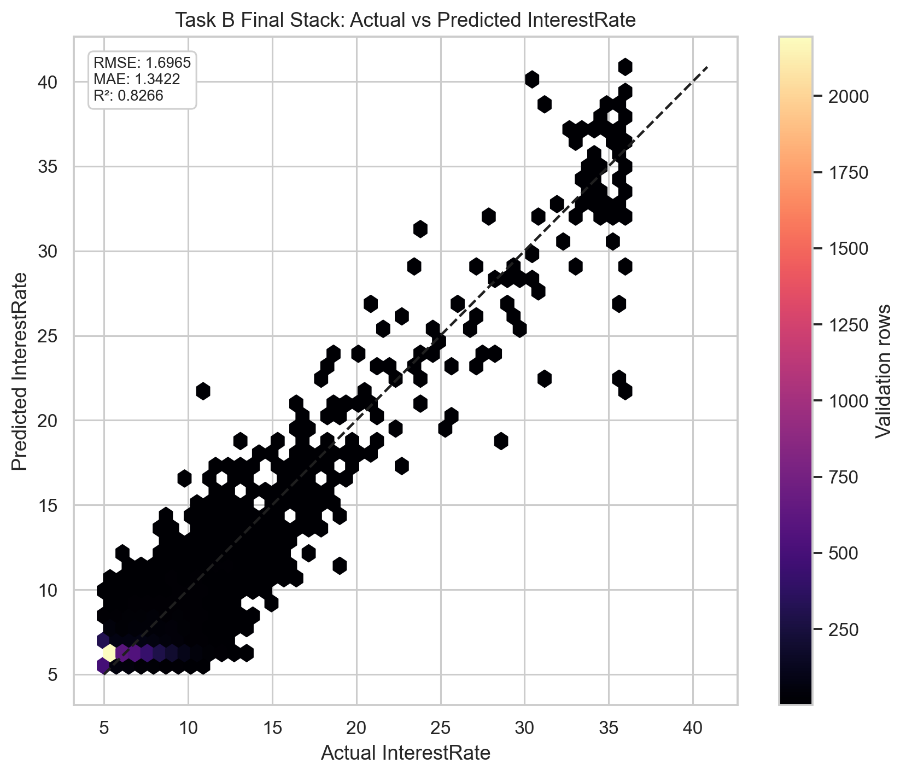
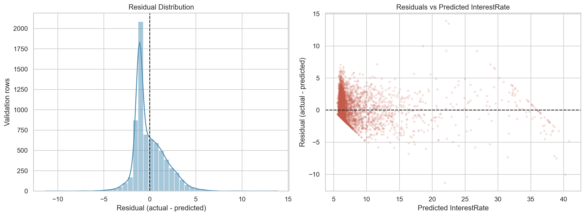
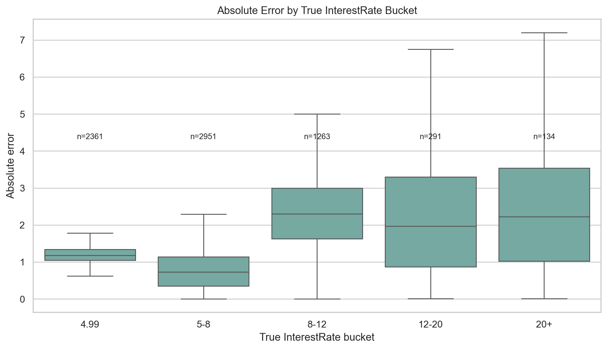

# CreditSense: Loan Risk Assessment Challenge

**Team name:** Tuffs & Guka  
**Student names:** Dachi Tchotashvili Giorgi Kekenadze Guka Matcharashvili

**Kaggle username(s):** Dachi Tchotashvili Giorgi Kekenadze Guram Matcharashvili

## 1. Data Exploration & Preprocessing

The training set has **35,000 rows**, **55 input features**, and two targets. For Task A, the class balance is close to uniform across the five risk tiers, so we did **not** need reweighting or resampling just to make accuracy usable.

- tier 0 = 6,724, tier 1 = 7,283, tier 2 = 6,998, tier 3 = 6,812, tier 4 = 7,183.

The first thing that actually mattered was missingness. Large blocks of nulls were clearly structural, not random noise. `StudentLoanOutstandingBalance` is missing for **59.98%** of rows, `CollateralType` for **55.06%**, `CollateralValue` for **54.64%**, and both `MortgageOutstandingBalance` and `PropertyValue` for about **45%**. We treated this as signal about whether an applicant even has a given liability or asset.

*Figure 2. The largest missing blocks come from structurally absent collateral, asset, and loan-balance features.*

Next we checked the strongest target correlations. For `RiskTier`, the biggest drivers were `NumberOfLatePayments30Days` (`0.5707`), `RevolvingUtilizationRate` (`0.5540`), `NumberOfChargeOffs` (`0.4504`), and `NumberOfCollections` (`0.4413`). For `InterestRate`, the same credit-history variables became even stronger, especially `NumberOfChargeOffs` (`0.6484`) and `NumberOfLatePayments90Days` (`0.5500`). This told us early that delinquency severity was the main backbone of both tasks.

*Figure 3. Both tasks are dominated by credit-history severity, but pricing is even more sensitive to severe derogatory marks such as charge-offs and 90-day delinquencies.*

We then condensed the multivariate view into a smaller numeric correlation matrix instead of dumping all 55 features. That made the important structure easier to read: late-payment counts, charge-offs, collections, utilization, and `RiskTier` form one tight risk cluster, while `AnnualIncome` pulls in the opposite direction.

*Figure 4. Correlation matrix for the most informative numeric features and both targets. Late-payment counts, charge-offs, collections, utilization, and `RiskTier` form the dominant risk cluster, while `AnnualIncome` moves in the opposite direction.*

For Task B, we also inspected the target distribution directly because the regression loss landscape depends heavily on where the mass sits. `InterestRate` is strongly right-skewed: mean **7.31**, median **6.08**, IQR **2.95**, and **33.3%** of rows exactly at the floor rate **4.99**. The upper tail is thin but real: the 90th percentile is **10.27**, the 95th percentile is **12.96**, and the maximum is **35.99**. That immediately suggested that the model performs differently across interest-rate ranges.

*Figure 5. The Task B target is concentrated near the floor rate of `4.99`, with a long but thin right tail into high-risk pricing.*

We also checked how `InterestRate` moves with `RiskTier`. The median rate rises almost monotonically from tier `0` to tier `4`, but tier `4` also spreads out much more than the others. In practice, that meant the hardest regression cases were concentrated exactly where borrower risk was most extreme.

*Figure 6. Interest rates rise systematically with `RiskTier`, and the highest-risk group has the broadest pricing spread.*

Finally, we separated the Task B-specific numeric correlations because they explain the regression stack much better than generic feature lists do. `NumberOfChargeOffs`, 30/60/90-day delinquencies, collections, and utilization dominate. `AnnualIncome` is the strongest negative term, but its magnitude is still much smaller than the credit-damage features.

*Figure 7. Task B is driven primarily by severe credit-history variables, while income acts as a weaker offsetting signal.*

From these checks, our preprocessing decisions were straightforward:

- For **Task A**, we first fixed leakage, then used explicit `"Missing"` categories, numeric missingness indicators, structural zero-fill where absence meant “does not have this”, median imputation elsewhere, 99th-percentile clipping, `log1p` on money-like features, and strict post-one-hot schema alignment.
- For **Task B**, we kept the pipeline simpler: median imputation for numerics, most-frequent imputation plus one-hot encoding for categoricals, and `StandardScaler` only on the neural-network branch.

## 2. Feature Engineering

| Addition | Motivation | Where used |
| --- | --- | --- |
| One-hot encoding for categorical features | Convert categorical labels into stable model-readable columns while preserving category identity after train / validation splitting | Task A and Task B |
| Numeric `*_is_missing` indicators | Preserve signal from structured missingness instead of hiding it behind imputation | Task A |
| Structural zero-fill for balances / assets | Encode “not present” as zero when that is the correct financial meaning | Task A |
| 99th-percentile clipping | Reduce sensitivity to extreme outliers in skewed financial variables | Task A |
| `log1p` transforms on money-like features | Compress long right tails and make relative differences more learnable | Task A |
| Pairwise products among top 10 correlated numeric features | Let the FC neural network model interactions between delinquency, utilization, and affordability signals | Task A FC neural network |
| Task-specific scaling | Standardize continuous inputs for logistic / MLP branches without distorting tree-model inputs | Task A stack and Task B MLP |

For the FC neural-network branch, we selected 10 fold-stable high-signal features and created all **45 pairwise products** among them. That expanded the processed matrix from **115** base features to **160** final features. We did this because the neural model could use explicit interaction terms, while the tree ensembles were already able to discover many of those splits on their own.

before/after check for the full upgraded Task A preprocessing bundle:

| Task A preprocessing setup | Evaluation protocol | Accuracy | Macro F1 | Change vs previous |
| --- | --- | ---: | ---: | --- |
| Leakage-free repaired baseline | Single 80/20 validation split | `0.8103` | `0.8120` | Baseline |
| One-hot + missing indicators + structural zero-fill + clipping + `log1p` | Single 80/20 validation split | `0.8121` | `0.8139` | `+0.0018` accuracy, `+0.0019` macro F1 |

The gain is small, but it's an honest work.

## 3. Model Selection

We tried several model family, or ensemble diversity.

### 3.1 Task A: Classification (`RiskTier`)

| Model | Evaluation protocol | Accuracy | Macro F1 | Notes |
| --- | --- | ---: | ---: | --- |
| FC neural network | 5-fold CV mean | `0.8157` | `0.8166` | `MLPClassifier` with 45 engineered pairwise interactions |
| Tree stack + CatBoost | 5-fold CV mean | `0.8231` | `0.8247` | RF + XGB + LGBM + native-categorical CatBoost, linear meta-layer |
| Tree stack + MLP | 5-fold CV mean | `0.8374` | `0.8380` | XGB + RF + HGB + logistic + MLP, multinomial logistic meta-learner |
| Optuna-tuned single XGBoost | 5-fold CV best trial | `0.7944` | `0.7950` | Strongest standalone XGB configuration found by TPE search |
| Standalone XGBoost validation run | Single 80/20 validation split | `0.7896` | `0.7903` | Rerun with Optuna-best parameters and Task A preprocessing |

Our best final classifier was the **Tree stack + MLP StackingClassifier** because it mixed different failure modes: tree models captured nonlinear tabular structure, while the logistic and MLP branches added smoother global boundaries and different probability shapes for the meta-learner.

### 3.2 Task B: Regression (`InterestRate`)

For Task B, we kept the same mindset: combine models that see the tabular space differently, then let a linear final estimator fuse them.

The five base regressors were:

- `XGBRegressor`
- `RandomForestRegressor`
- `HistGradientBoostingRegressor`
- `LinearRegression`
- `MLPRegressor`
- `Ridge(alpha=1.0)` as the final estimator in `StackingRegressor`

`HistGradientBoostingRegressor` was useful because it gave us a fast, scikit-learn-native boosted-tree baseline. It bins continuous features into histograms before evaluating splits, so it is lighter than classic XGBoost on memory and training overhead.

The `MLPRegressor` branch handled the same processed features with a different inductive bias. It uses standard backpropagation with the **ADAM** optimizer (`solver="adam"`), so its weights are updated with adaptive first- and second-moment estimates instead of plain gradient descent.

The final Task B stack achieved:

| Final Task B model | RMSE | MAE | R² |
| --- | ---: | ---: | ---: |
| StackingRegressor (XGB + RF + HGB + LR + MLP -> Ridge) | `1.6965` | `1.3422` | `0.8266` |

The reproduced single-model baselines on the same split make the same point as Task A: the stack beat every component model.

| Model | RMSE | MAE | R² |
| --- | ---: | ---: | ---: |
| HistGradientBoostingRegressor | `1.7196` | `1.3472` | `0.8219` |
| XGBRegressor | `1.7649` | `1.3787` | `0.8124` |
| RandomForestRegressor | `1.7917` | `1.4016` | `0.8066` |
| MLPRegressor | `1.8299` | `1.4274` | `0.7983` |
| LinearRegression | `2.5464` | `1.7083` | `0.6094` |
| StackingRegressor (final notebook artifact) | `1.6965` | `1.3422` | `0.8266` |

## 4. Hyperparameter Tuning

### 4.1 Earlier Gradient-Style Search

To try tuning hyperparameters, we first used **SPSA** (Simultaneous Perturbation Stochastic Approximation). But it turns out, tree ensembles with rounded integer parameters and validation-based objectives are not a natural fit for ordinary gradient-style search. We kept it as a baseline idea and moved to Optuna because Bayesian search is much better suited to mixed discrete + continuous tree hyperparameters.

### 4.2 XGBoost + Optuna Pipeline

Due to computational constraints, we decided to experiment with Optuna on a model that only used XGBoost.

The full tuning workflow lives in [taskA_xgboost_optuna.ipynb](../task_a/notebooks/taskA_xgboost_optuna.ipynb) and [taskA_xgb_optuna.py](../task_a/scripts/taskA_xgb_optuna.py).

We used **TPE** (Tree-structured Parzen Estimator), which is Optuna’s Bayesian optimization sampler. The practical idea is simple: after each completed trial, it updates a probabilistic view of which parts of the hyperparameter space look promising and biases the next sample in that direction instead of sweeping blindly like grid search.

The fixed study settings were:

| Setting | Value |
| --- | --- |
| Study name | `taskA_xgb_optuna` |
| Sampler | `TPESampler(seed=42)` |
| Trials | `25` |
| Outer CV | `StratifiedKFold(n_splits=5, shuffle=True, random_state=42)` |
| Metric optimized | `accuracy` |
| Early stopping | `True` |
| Early stopping rounds | `40` |
| Internal early-stopping holdout | `0.1` of the fold-training partition |
| `scale_pos_weight` search | Disabled (`include_scale_pos_weight=False`) because Task A is multiclass |

The tuning pipeline itself was deliberately conservative:

1. Sample one candidate hyperparameter set.
2. Run 5-fold stratified CV.
3. Keep each outer validation fold clean for scoring only.
4. Inside each training fold, carve out a smaller inner holdout for early stopping.
5. Fit the Task A preprocessor only on the fold-training subset.
6. Train `XGBClassifier` with early stopping.
7. Extract `best_iteration` / `best_n_estimators`.
8. Refit on the full outer training fold with that tree count.
9. Score the outer validation fold.
10. Return mean fold accuracy to Optuna.

That separation matters because it lets early stopping help training without contaminating the outer fold score.

The exact search space was:

| Hyperparameter | Distribution | Search range | Best value found |
| --- | --- | --- | ---: |
| `n_estimators` | Integer | `200` to `1200` | `1035` |
| `max_depth` | Integer | `3` to `10` | `6` |
| `learning_rate` | Log-uniform float | `0.01` to `0.30` | `0.0399230666` |
| `min_child_weight` | Float | `1.0` to `12.0` | `4.4423116573` |
| `subsample` | Float | `0.6` to `1.0` | `0.8524337374` |
| `colsample_bytree` | Float | `0.6` to `1.0` | `0.8837262829` |
| `gamma` | Float | `0.0` to `5.0` | `1.1909377972` |
| `reg_alpha` | Log-uniform float | `1e-8` to `10.0` | `0.0159368471` |
| `reg_lambda` | Log-uniform float | `1e-3` to `25.0` | `0.0318485426` |

The best completed trial reached:

- **Mean 5-fold CV accuracy:** `0.7944`
- **Mean 5-fold CV macro F1:** `0.7950`
- **Best standalone rerun on a fresh 80/20 validation split:** `0.7896` accuracy, `0.7903` macro F1

We reconstructed the finished study from `task_a/artifacts/taskA_xgb_optuna_optuna_trials.csv` and used `optuna.visualization.plot_slice` to inspect how each searched hyperparameter related to mean CV accuracy.

*Figure 8. Slice plots reconstructed from the completed Optuna study. Each panel shows one searched hyperparameter against mean 5-fold CV accuracy.*

The answer to the original tuning question was clear: Optuna improved the standalone XGBoost branch, but not enough to beat the stronger heterogeneous stacks. That was useful because it separated **tuning gains** from **representation + ensemble gains**.

## 5. Results & Summary

### 5.1 Task A Classifier Summary

| Model | Evaluation protocol | Accuracy | Macro F1 |
| --- | --- | ---: | ---: |
| Single XGBoost | Single 80/20 validation split | `0.7896` | `0.7903` |
| Optuna-tuned single XGBoost | 5-fold CV mean (best trial) | `0.7944` | `0.7950` |
| Leakage-free baseline | Single 80/20 validation split | `0.8103` | `0.8120` |
| Upgraded one-hot + clipping | Single 80/20 validation split | `0.8121` | `0.8139` |
| FC neural network | 5-fold CV mean | `0.8157` | `0.8166` |
| Tree stack + CatBoost | 5-fold CV mean | `0.8231` | `0.8247` |
| Tree stack + MLP | 5-fold CV mean | `0.8374` | `0.8380` |

*Figure 9. Horizontal accuracy comparison of all recorded Task A classifiers. Colors indicate evaluation protocol, so the plot should be interpreted together with the table above.*

Its confusion matrix for Tree stack + MLP:

*Figure 10. Confusion matrix of the best final Task A classifier (Task B-style StackingClassifier).*

The error pattern also matches the rest of the project: the model is strongest on the extreme class `VeryHigh(4)` and still struggles most on the middle buckets, especially `Low(1)` and `Moderate(2)`. In other words, the ambiguous middle remains harder than the endpoints.

### 5.2 Task B Regression Summary

Task B followed the same story: diverse ensembles beat stronger-tuned individual models.

| Final Task B model | RMSE | MAE | R² |
| --- | ---: | ---: | ---: |
| StackingRegressor (XGB + RF + HGB + LR + MLP -> Ridge) | `1.6965` | `1.3422` | `0.8266` |

The full comparison is below. `HistGradientBoostingRegressor` was the strongest single model at `R² = 0.8219`, but the stack still won on **all three** reported metrics.

*Figure 11. Task B model comparison on the shared 80/20 validation split. The final stack is best across all three reported regression metrics.*

We also saved a few holdout diagnostics because a single average metric hides where regression models fail:

- mean residual (`actual - predicted`): `-0.0505`
- median absolute error: `1.1312`
- 90th percentile absolute error: `2.6939`
- predictions within `±1.0` interest-rate point: `38.36%`

The actual-vs-predicted plot shows that the model tracks the dense low-to-mid-rate region well, but the sparse high-rate tail spreads out much more.

*Figure 12. Hexbin view of the final Task B stack. Most loans sit close to the diagonal, but the sparse high-rate tail is harder to price tightly.*

The residual plots say the same thing from the error side: overall bias stays small, but variance grows as predicted rates increase.

*Figure 13. Residual distribution and residuals vs predicted values for the final Task B stack. Errors widen in the upper-rate region even though the overall bias remains small.*

Bucketed absolute error makes this easier to see. Error is tightest in the dominant `5-8` region and still fairly controlled at the floor rate `4.99`, but it grows sharply in `8-12`, `12-20`, and especially `20+`. That lines up with the data distribution: the difficult high-rate buckets are also the smallest ones.

*Figure 14. Absolute error by true interest-rate bucket. The model is strongest in the dense low-rate regime and weakest in the sparse high-rate tail.*
